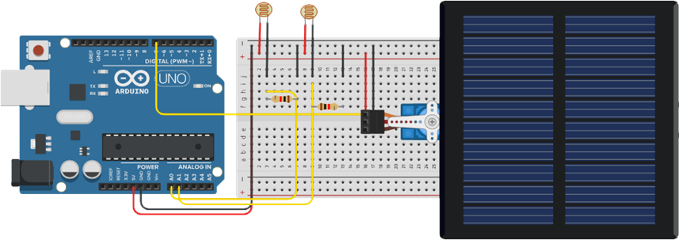
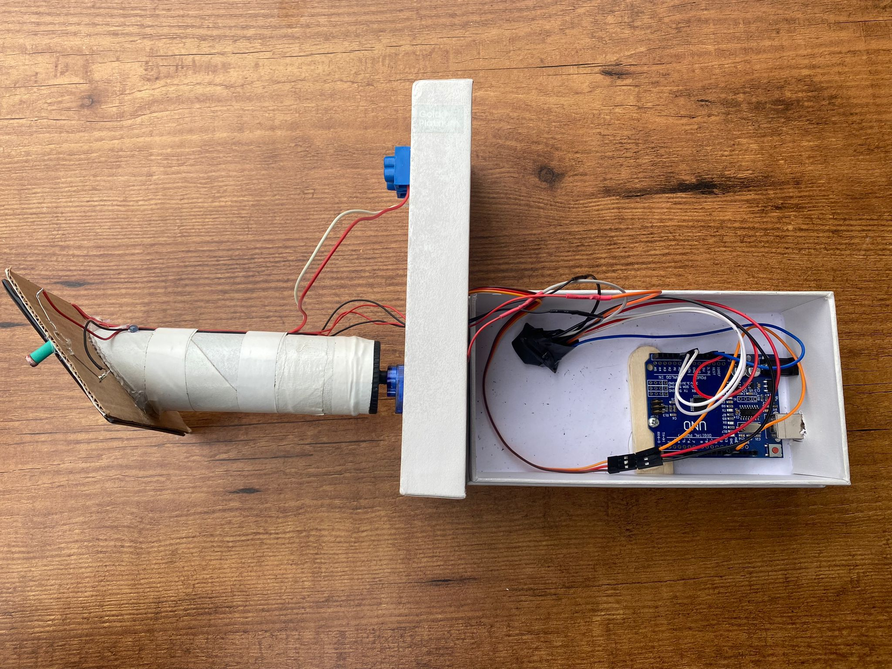
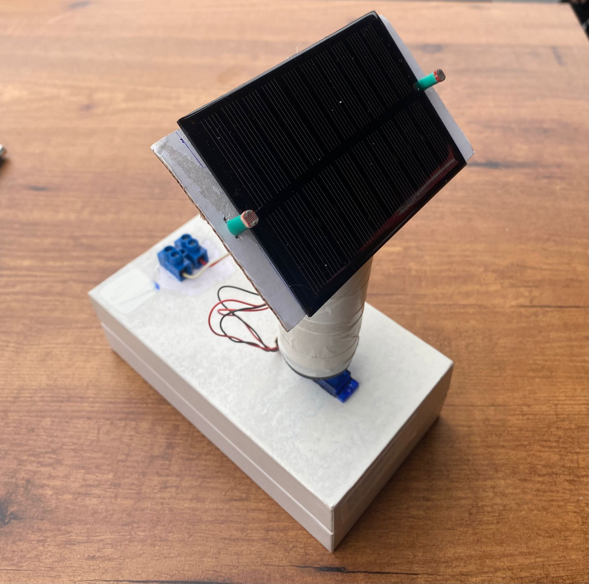
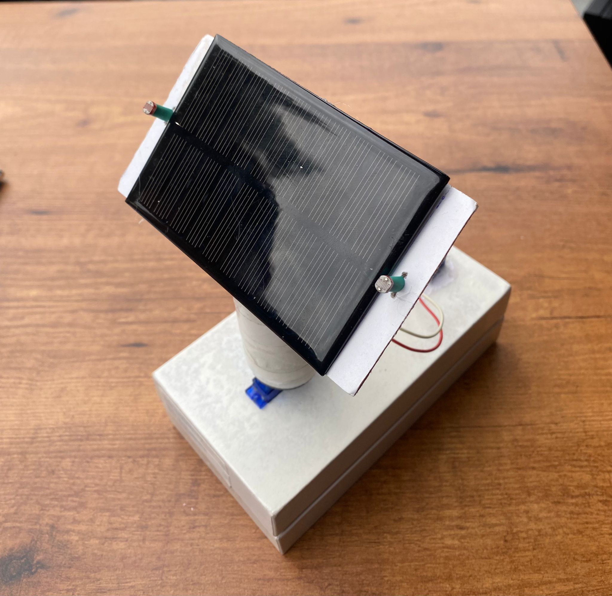

# Ardupanel (Günebakan)

Ardupanel, known as Günebakan in Turkish, is a solar tracking project developed using an Arduino, Light Dependent Resistors (LDRs), a servo motor, and a solar panel. This project was created for an Optoelectronic lesson in collaboration with a classmate.

## Table of Contents

- [Introduction](#introduction)
- [Components](#components)
- [Circuit Diagram](#circuit-diagram)
- [Code Explanation](#code-explanation)
- [Setup and Usage](#setup-and-usage)
- [Project Development](#project-development)
- [What We Learned](#what-we-learned)
- [Our Mistakes](#our-mistakes)
- [Simulation](#simulation)
- [Images](#images)
- [License](#license)

## Introduction

Ardupanel is designed to maximize the efficiency of solar panels by automatically adjusting their position to follow the sunlight. This ensures that the solar panel is always at the optimal angle to receive the most sunlight, thereby increasing its energy output.

## Components

- Arduino Uno
- 2 Light Dependent Resistors (LDRs)
- 1 Servo Motor
- 1 Solar Panel
- 2 10kΩ Resistors

## Circuit Diagram



## Code Explanation

The code for this project can be divided into several key parts:

### 1. Initialization

```cpp
#define ldr_up A0
#define ldr_down A1
#define panel_servo 11
#include <Servo.h>

Servo Panel;
int min_angle = 0;
int max_angle = 180;
```
- **Defines**: Assigns names to the pins connected to the LDRs and servo.
- **Includes**: Adds the Servo library to control the servo motor.
- **Servo Object**: Creates a servo object to control the solar panel.
- **Angle Limits**: Sets the minimum and maximum angles for the servo motor.

### 2. Setup

```cpp
void setup() {
  Serial.begin(9600);
  Panel.attach(panel_servo);
  Panel.write(90); // Start at 90 degrees (middle position)
}
```
- **Serial Communication**: Initializes serial communication for debugging.
- **Servo Attachment**: Attaches the servo motor to the specified pin.
- **Initial Position**: Sets the servo motor to the middle position (90 degrees).

### 3. Main Loop

```cpp
void loop() {
  int level_up = analogRead(ldr_up);
  int level_down = analogRead(ldr_down);

  // Calculate the difference between LDR readings
  int difference = level_up - level_down;

  // Map the difference to an angle around the center (90 degrees)
  int angle = map(difference, -512, 512, min_angle, max_angle);

  // Constrain the calculated angle within the defined range
  angle = constrain(angle, min_angle, max_angle);

  Serial.print("Level Up: ");
  Serial.print(level_up);
  Serial.print(" Level Down: ");
  Serial.print(level_down);
  Serial.print(" Difference: ");
  Serial.print(difference);
  Serial.print(" Mapped Angle: ");
  Serial.println(angle);

  // Set the servo position based on the constrained angle
  Panel.write(angle);

  delay(100); // Adjust delay as needed for your application
}
```
- **Read LDR Values**: Reads the light levels from the two LDRs.
- **Calculate Difference**: Computes the difference between the two readings.
- **Map Difference to Angle**: Maps this difference to an angle for the servo motor.
- **Constrain Angle**: Ensures the angle stays within the defined limits.
- **Print to Serial**: Outputs the readings and calculated angle for debugging.
- **Set Servo Position**: Moves the servo motor to the calculated angle.
- **Delay**: Waits before taking the next reading.

## Setup and Usage

1. **Wiring**: Connect the components as per the circuit diagram.
2. **Upload Code**: Upload the provided Arduino code to your Arduino Uno.
3. **Power Up**: Power up the Arduino. The servo motor will adjust the solar panel's angle based on the readings from the LDRs.
4. **Monitor**: Use the Serial Monitor to observe the readings from the LDRs and the corresponding servo angles.

## Project Development

During the development of Ardupanel, we divided the responsibilities to ensure efficient progress:
- **Coding, Testing, and Simulation**: Handled by me.
- **Circuit Design and Mounting Components**: Managed by my classmate, who built the stand for the servo and panel.

## What We Learned

Through this project, we gained valuable insights into:
- **Servo Motor Control**: Understanding how to control and manipulate servo motors using Arduino.
- **Light Sensing**: Utilizing LDRs to measure light intensity and react accordingly.
- **Project Collaboration**: Working effectively as a team to combine our strengths and complete the project successfully.

## Our Mistakes

Despite our successes, we encountered some challenges:
- **Initial Calibration Issues**: The LDRs required precise calibration to ensure accurate readings.
- **Mechanical Stability**: Ensuring the mount for the solar panel was stable and could handle the servo movements without wobbling.
- **Power Supply**: We initially underestimated the power requirements for the servo motor, leading to inconsistent performance.

## Simulation

For simulation purposes, the Proteus file and the HEX file generated from the Arduino code are provided in the repository. You can find them under the `simulation` directory:

- **Proteus Project File**: `Simulation/Circuit.pdsprj`
- **HEX File**: `Simulation/Code_with_bootloader.hex`

These files can be used to simulate the circuit and verify the functionality of the code in Proteus.

## Images

### Inside View


### Left View


### Right View


## License

This project is licensed under the MIT License. See the [LICENSE](LICENSE) file for more details.

---
